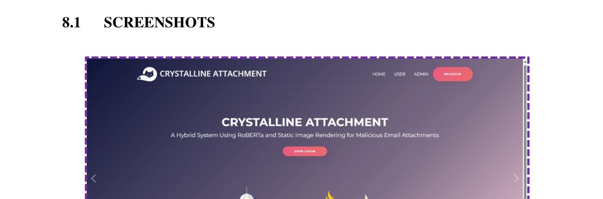
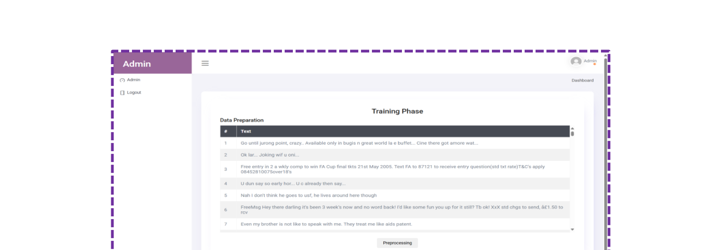
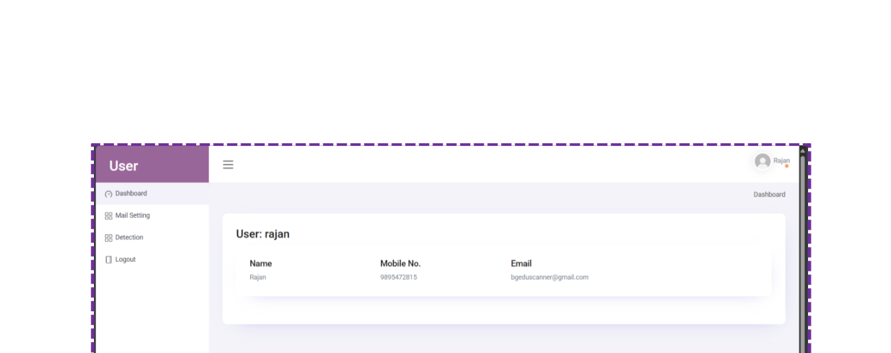
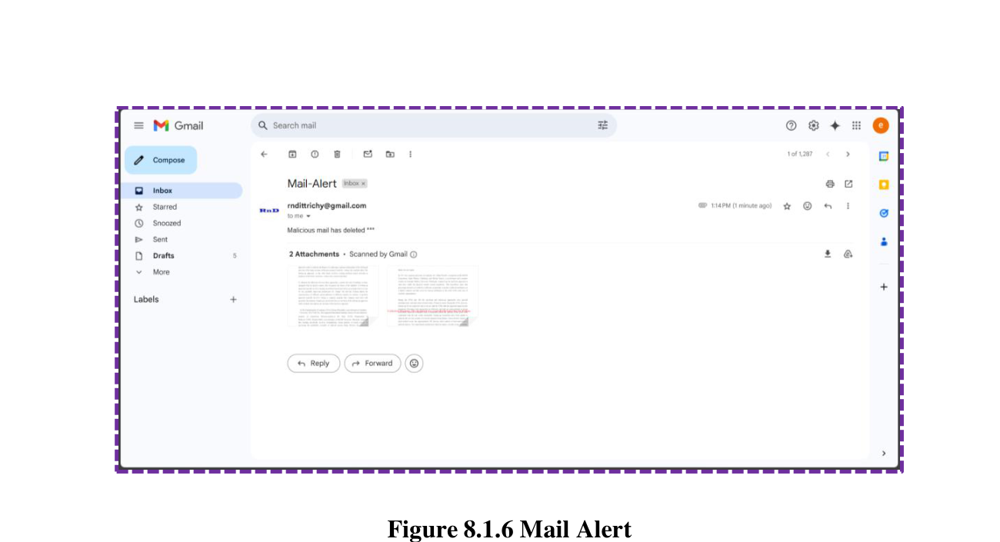

# Opaline Attachment Defence System

> **Proactive Detection and Sanitization of Malicious Email Files**  
> Published in *Indian Journal of Computer Science and Technology (INDJCST)* — Volume 5, Issue 1, PP 350–354  
> Presented at **ICNTSETM'26**, P.S.V. College of Engineering and Technology

---

## Overview

Opaline is an AI-powered email security system that detects and neutralizes malicious email attachments in real time. Instead of relying solely on signature-based antivirus, it uses a **DistilBERT-based CANet model** to classify attachments as safe or malicious, then converts flagged files into **static PNG images** — stripping all executable content before the user ever sees them.

---

## Tech Stack


---

## Key Features

| Feature | Description |
|---|---|
| **AI Detection** | DistilBERT + CANet classifies attachments as spam/ham |
| **Sandboxed Rendering** | Malicious files converted to static PNG (no code execution) |
| **Multi-format Support** | Handles `.txt`, `.docx`, `.pdf` attachments |
| **Real-time IMAP Scan** | Monitors Gmail inbox continuously for new threats |
| **Instant Alerts** | Sends email warning to user when threat is detected |
| **Admin Dashboard** | Upload datasets, train model, manage users |

---

## Screenshots

### Landing Page


### Admin — Model Training Phase


### User Dashboard


### Mail Alert — Threat Detected


---

## Results

| Parameter | Existing (Antivirus) | Opaline | Improvement |
|---|---|---|---|
| Detection Accuracy | 72% | **94%** | +22% |
| Zero-Day Detection | 31% | **87%** | +56% |
| False Positive Rate | 9% | **6%** | −3% |
| Processing Speed | 12s/file | **6s/file** | +50% |
| Attacker Evasion Rate | 69% | **13%** | −56% |

---

## Tech Stack Details

- **Backend:** Python 3.8, Flask
- **Frontend:** React JS, Bootstrap 4
- **Database:** MySQL 5 (WampServer)
- **ML Model:** DistilBERT (HuggingFace Transformers), TensorFlow
- **NLP Pipeline:** TF-IDF, Bag-of-Words, Word2Vec, Gensim
- **Email:** IMAP SSL (Gmail), Flask-Mail (SMTP)

---

## Project Structure

```
opaline_project/
│
├── app.py                   # Flask app — routes, session, mail config
├── preprocessing.py         # NLP pipeline: tokenize, clean, stem, lemmatize
├── feature_extraction.py    # BoW, TF-IDF, word cloud, visualizations
├── model_training.py        # CANet (DistilBERT) — train & validate
├── attachment_converter.py  # TXT/DOCX/PDF → PNG sandboxed conversion
├── email_scanner.py         # IMAP real-time inbox monitor
├── schema.sql               # MySQL database schema
├── requirements.txt         # Python dependencies
│
├── static/
│   ├── dataset/             # spam.csv training dataset
│   ├── graph/               # generated charts & word clouds
│   └── attachments/         # uploaded & converted attachment files
│
├── templates/               # Jinja2 HTML templates
└── screenshots/             # Project screenshots
```

---

## Setup & Installation

### 1. Clone the repository
```bash
git clone https://github.com/akashak328/opaline-attachment-defence.git
cd opaline-attachment-defence
```

### 2. Install dependencies
```bash
pip install -r requirements.txt
```

### 3. Set up the database
- Start WampServer / MySQL
- Run the schema:
```bash
mysql -u root -p < schema.sql
```

### 4. Add your dataset
- Place `spam.csv` in `static/dataset/`
- CSV format: columns `v1` (label: spam/ham) and `v2` (email text)

### 5. Train the model
```bash
python model_training.py
```

### 6. Run the app
```bash
python app.py
```
Open `http://localhost:5000` in your browser.

---

## How It Works

```
Incoming Email
      │
      ▼
Extract Attachment (.txt / .docx / .pdf)
      │
      ▼
NLP Preprocessing (tokenize → clean → TF-IDF)
      │
      ▼
DistilBERT CANet Classification
      │
   ┌──┴──┐
 SPAM    HAM
   │      │
   ▼      ▼
Convert  Deliver
to PNG   safely
   │
   ▼
Alert User + Delete Original
```

---

## Publication

- **Journal:** Indian Journal of Computer Science and Technology (INDJCST)  
  e-ISSN: 2583-5300 | Impact Factor: 6.211 | UGC-CARE Listed  
- **Conference:** ICNTSETM'26 — 3rd International Conference on New Trends in Science, Engineering, Technology and Management

---

## License

This project is submitted for academic purposes under Anna University.  
© 2026 — All rights reserved.
